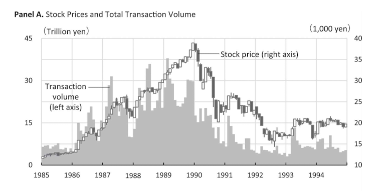
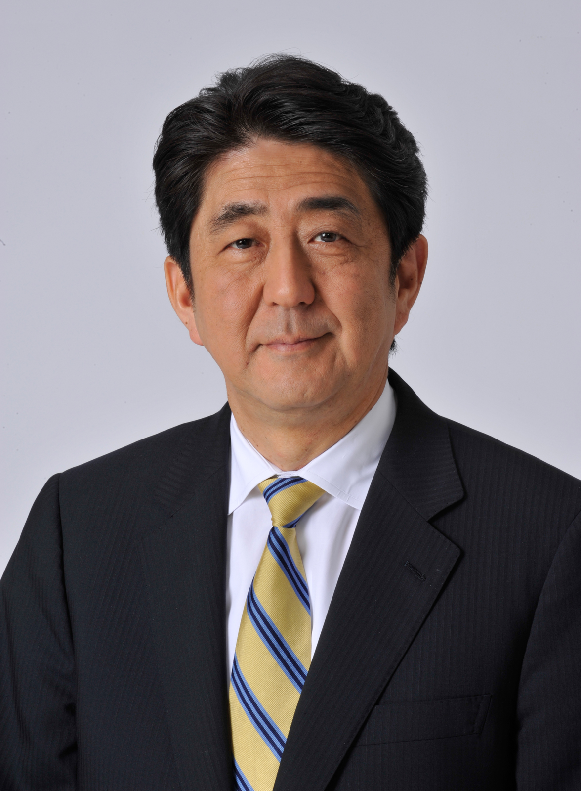

```{r setup-chunk, include=FALSE}
knitr::opts_chunk$set(echo = TRUE, 
                      cache = FALSE, 
                      message=FALSE, 
                      warning=FALSE) 

```


# My Background

- I am an Associate Professor of Economics at Aoyama Gakuin University.
- My research interests are in international trade, foreign direct investment, natural disaster, and cultural economics.
- It means that I am not an expert on macroeconomics, but I am interested in the Japanese economy as an economist and as a citizen.
- I first met Professor Lin in 2009 in Taipei, Taiwan, when I was a graduate student at Kyoto University.
- Since then, I have met him in various occasions in Tokyo and Osaka.
- I am very happy to have this opportunity to discuss on Japanese economy with students from NCCU today.

# Introduction

- Japan is the third largest economy in the world.
- However, the economy has been stagnating for the past two decades.
- Figure shows the per capita GDP of Japan and the US. The gap between the two countries has been widening since the 1990s.

{width=70%}


# The Japanese Economy


::: {}
- Most of materials are from the book [\textit{The Japanese Economy}](https://mitpress.mit.edu/9780262538244/the-japanese-economy/), 2nd edition, MIT Press, by Takatoshi Ito and Takeo Hoshi.

:::

::: {}

{width=30%}

:::

# The Lost Two Decades

- After the burst of the bubble in the early 1990s, the Japanese economy has been stagnating.
- The figure shows the real and nominal GDP growth rate of Japan. The average growth rate of real GDP has been less than 1% since the 1990s.


- GFC: Global Financial Crisis

# Phases 1 and 2. The bubble economy and the burst
- The bubble economy in the late 1980s was characterized by the rapid increase in asset prices, especially in the stock and real estate markets.
- The bubble burst in the early 1990s, and the asset prices plummeted.
- It resulted in the non-performing loans in the banking sector, which led to the banking crisis.
- The banks stopped lending, and the economy went into a recession.
- The government finally had to inject public funds to save the banks.

# Stock prices

- The figure shows the stock price index.
- The stock prices increased rapidly in the late 1980s, and then dropped sharply in the early 1990s.



# Some implications on exports

Amiti, M., & Weinstein, D. E. (2011). Exports and financial shocks. \textit{The Quarterly Journal of Economics}, 126(4), 1841-1877. <https://doi.org/10.1093/qje/qjr033>

- Amiti and Weinstein (2011) examine the impact of Japan's financial shocks on exports.
- The data set covers the Japanese financial crises from 1990 through 2010.
- They match exporters with the main bank that provides them with trade finance.
- They find that the health of banks providing trade finance is an important determinant of firm-level exports during crises.

# Phase 3. Koizumi reform
- Junichiro Koizumi became the Prime Minister in 2001.
- He implemented the structural reform, including the privatization of the postal service, the reform of the pension system, and the deregulation of the economy.
- The economy started to recover, and the GDP growth rate increased.
- However, the recovery was short-lived, and the economy went back to stagnation. His reform produced non-regular workers, who are not protected by the traditional Japanese labor system.

{width=20%}

Source: [Wikipedia](https://en.wikipedia.org/wiki/Junichiro_Koizumi)


# Phase 4. Global Financial Crisis
- The global financial crisis in 2008 hit the Japanese economy hard.
- The exports to th US and other countries dropped sharply.
- As a results, the GDP growth rate plummeted, and the economy went into a recession.
- The government implemented the fiscal stimulus package, but the economy did not recover.

# Phase 5. Abenomics
- Shinzo Abe became the Prime Minister in 2012.
- He implemented the three arrows of Abenomics:
  1. monetary easing
  2. fiscal stimulus, and
  3. structural reform.
- The economy started to recover, and the GDP growth rate increased.
- However, his policy did not solve the structural problems of the Japanese economy, i.e., low productivity growth.

{width=20%}

Source: [Wikipedia](https://en.wikipedia.org/wiki/Shinzo_Abe)

# What is the problem?

- [Hayashi and Prescott (2002)](https://doi.org/10.1006/redy.2001.0149) argue that the problem is not the breakdown of the financial system.
- They find that corporations large and small were able to find financing for investments.
- The problem is a low productivity growth rate.
- Growth theory, treating TFP as exogenous, accounts well for the Japanese lost decade of growth.
- They think that research effort should be focused on what policy changes will allow productivity to again grow rapidly.

\centering
{width=50%}


# The Growth Model

- The aggregate production function is given by
$$
Y=A K^{\theta}(h E)^{1-\theta} \qquad (1)
$$
where 
- $Y$ is aggregate output, 
- $A$ is TFP, $K$ is aggregate capital, 
- $E$ is aggregate employment, and 
- $h$ is hours per employee.
- The parameter $\theta$ is the capital share in output. 

# Growth Accounting
- Let $N$ be the working-age population and define

$$
y \equiv Y / N, \quad e \equiv E / N, \quad x \equiv K / Y
$$

- Using these definitions on (1) and by simple algebra, we obtain
$$
y=A^{1 /(1-\theta)} h e x^{\theta /(1-\theta)}
$$

- The output per adult $y$ can be decomposed into four factors: 

1. the TFP factor $A^{1 /(1-\theta)}$, 
1. the workweek factor $h$, 
1. the employment rate factor $e$, and
1. the capital intensity factor $x^{\theta /(1-\theta)}$.  
    - The capital share parameter is set at 0.362.

# Growth Accounting Results

\centering
{width=100%}

- The contribution of TFP growth between 1983--1991 and 1991--2000 accounts for nearly all of the decline in the growth rate (the growth in output per working-age person). 

<!--
- In spite of the low TFP growth in the 1973--1983 period, output per adult increased at 2.2%. The reason that growth in output per adult was higher in the 1973--1983 period than in the 1991--2000 period is that in the earlier period there was significantly more capital deepening and a smaller reduction in the labor input per working-age person.
-->

# The reasons for the low TFP growth

- [Fukao (2013)](https://doi.org/10.1111/aepr.12020) argues that the low TFP growth is due to the slow accumulation of information and communication technology capital and intangible investment.
- Using the firm-level data, he finds that the large firms have expanded their supply chains globally and relocated their factories abroad. They enjoyed an acceleration in the total factor productivity growth in recent years.
- On the other hand, the small- and medium-sized enterprises were left behind in information and communication technology capital and intangible investment, and their productivity growth has been very low.

\centering
{width=60%}


# Natural Disasters

- Japan is prone to natural disasters, such as earthquakes, tsunamis, and typhoons.
- The Great East Japan Earthquake in 2011 caused a huge damage to the economy. 
- It damaged the Fukushima nuclear power plant, and the nuclear accident caused the evacuation of the residents in the area.
- Japan has stopped the operation of most nuclear power plants.

\centering
{width=50%}

Note: Ishinomaki, Miyagi Prefecture, in 2011


# Electricity Generation

- The figure shows that Japan has been relying on fossil fuels for electricity generation since the Fukushima nuclear accident.
- Japan has been importing natural gas, oil, and coal from abroad. It has been a factor increasing the trade deficit.

\centering
{width=70%}

Source: <https://www.fepc.or.jp/nuclear/state/setsubi/index.html>

# Other issues

- Japanese economy has other issues, such as
  - Aging population,
  - Large government debt, and
  - Scarce innovation.

- Having severe economic problems, people lost confidence in the country. As a result, Japan face political issues, such as
  - Growing nationalism and
  - Populism.

- SNS such as X (Twitter) have been used to spread fake news and hate speech.
- Gender inequality is still a big issue in Japan. Typically, women change their family name after marriage. The reform of the laws that allow couples to have separate surnames face strong opposition from conservative groups. 


# Conclusion

- The Japanese economy has been stagnating for the past three decades. 
- The problem is the low productivity growth rate, accompanied by population aging, large government debt, and scarce innovation.
- It has even faced a challenge due to the suspension of nuclear power plants.
- The government has implemented various policies, but the economy has not recovered. People do not believe in the government, making it difficult for the government to reduce the public debt.
- The gender inequality should be improved in many aspects.


